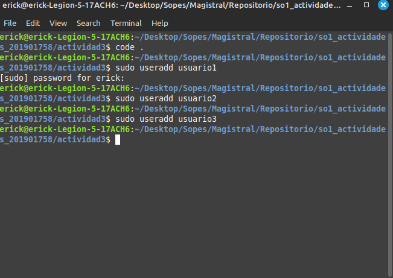
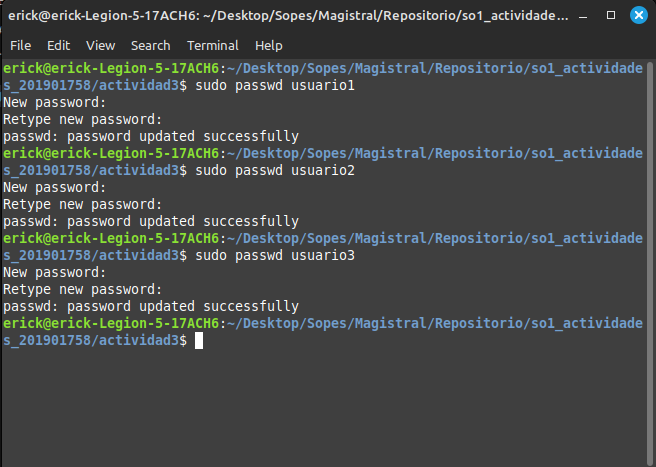
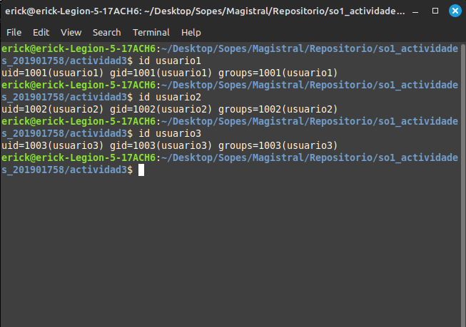
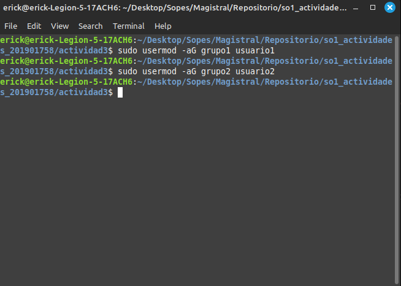
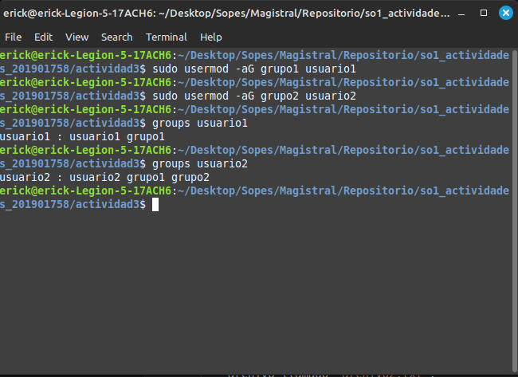

# Parte 1: Gestión de Usuarios

1. Creación de Usuarios: Crea tres usuarios llamados `usuario1`, `usuario2` y `usuario3`.

2. Asignación de Contraseñas: Establece una nueva contraseñas para cada usuario creado.

3. Información de Usuarios: Muestra la información de `usuario1` usando el comando `id`.

4. Eliminación de Usuarios: Elimina `usuario3`, pero conserva su directorio principal.

                       ### Se utilizo: sudo userdel usuario3

# Parte 2: Gestión de Grupos

1. Creación de Grupos: Crea dos grupos llamados `grupo1` y `grupo2`.

2. Agregar Usuarios a Grupos: Agrega `usuario1` a `grupo1` y `usuario2` a `grupo2`.

3. Verificar Membresía: Verifica que los usuarios han sido agregados a los grupos utilizando el comando `groups`.

4. Eliminar Grupo: Elimina `grupo2`.

                                ### sudo groupdel grupo2

# Parte 3: Gestión de Permisos

1. Creación de Archivos y Directorios:

    Como `usuario1`, crea un archivo llamado `archivo1.txt` en su directorio principal y escribe algo en él.
    Crea un directorio llamado `directorio1` y dentro de ese directorio, un archivo llamado `archivo2.txt`.

        su usuario 1
        cd /home

        sudo -u usuario1 touch ~/archivo1.txt
        sudo -u usuario1 echo "Contenido del archivo1" > ~/archivo1.txt

        sudo -u usuario1 mkdir ~/directorio1
        sudo -u usuario1 touch ~/directorio1/archivo2.txt

2. Verificar Permisos: Verifica los permisos del archivo y directorio usando el comando `ls -l` y `ls -ld` respectivamente.

ls -l ~/archivo1.txt
ls -ld ~/directorio1

3. Modificar Permisos usando `chmod` con Modo Numérico: Cambia los permisos del `archivo1.txt` para que sólo `usuario1` pueda leer y escribir (permisos `rw-`), el grupo pueda leer (permisos `r--`) y nadie más pueda hacer nada.

sudo -u usuario1 chmod 640 ~/archivo1.txt

4. Modificar Permisos usando `chmod` con Modo Simbólico: Agrega permiso de ejecución al propietario del `archivo2.txt`.

sudo -u usuario1 chmod u+x ~/directorio1/archivo2.txt

5. Cambiar el Grupo Propietario: Cambia el grupo propietario de `archivo2.txt` a `grupo1`.

sudo chown :grupo1 ~/directorio1/archivo2.txt

6. Configurar Permisos de Directorio: Cambia los permisos del `directorio1` para que sólo el propietario pueda entrar (permisos `rwx`), el grupo pueda listar contenidos pero no entrar (permisos `r--`), y otros no puedan hacer nada.

        sudo -u usuario1 chmod 750 ~/directorio1

7. Comprobación de Acceso: Intenta acceder al `archivo1.txt` y `directorio1/archivo2.txt` como `usuario2`. Nota cómo el permiso de directorio afecta el acceso a los archivos dentro de él.

        sudo -u usuario2 cat ~/archivo1.txt
        sudo -u usuario2 cat ~/directorio1/archivo2.txt

        touch: cannot touch '/home/archivos.txt': Permission denied

8. Verificación Final: Verifica los permisos y propietario de los archivos y directorio nuevamente con `ls -l` y `ls -ld`.

        ls -l ~/archivo1.txt
        ls -ld ~/directorio1

Reflexión: (Opcional)

Contestar las siguientes preguntas:

    ¿Por qué es importante gestionar correctamente los usuarios y permisos en un sistema operativo?

    Porque te da la capacidad de que en un mismo sistema operativo puedan interactuar diferentes usuarios sin invadir contenido de otros o generar conflictos.

    ¿Qué otros comandos o técnicas conocen para gestionar permisos en Linux?

    sudo, para ejecutar comandos de usuario y chgrp para cambiar grupos

