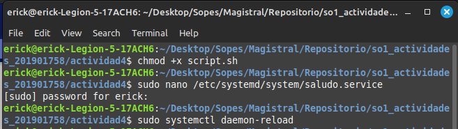
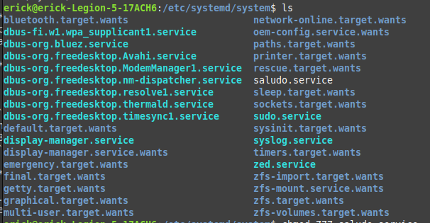

# Proceso de instalacion 

Primero se genera el archivo del script con la informacion correspondiente

Se le otorgan permisos de instalacion 

            chmod +x script.sh

Se crea un archivo de unidad de systemd para el servicio

            sudo nano /etc/systemd/system/saludo.service

            contenido:
            [Unit]
            Description=Script de saludo y fecha

            [Service]
        ExecStart  =   
        home/erick/Desktop/Sopes/Magistral/Repositorio/so1_actividades_201901758/actividad4/script.sh

            [Install]
            WantedBy=default.target

Recargar servicios

        sudo systemctl daemon-reload

Habilitar servicio

        sudo systemctl start saludo.service

